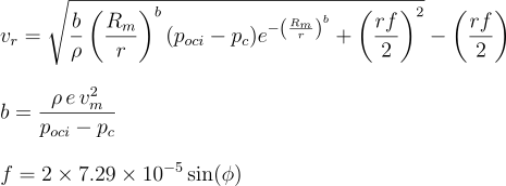
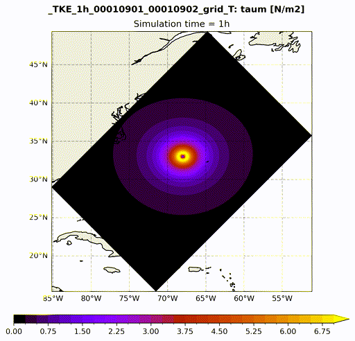
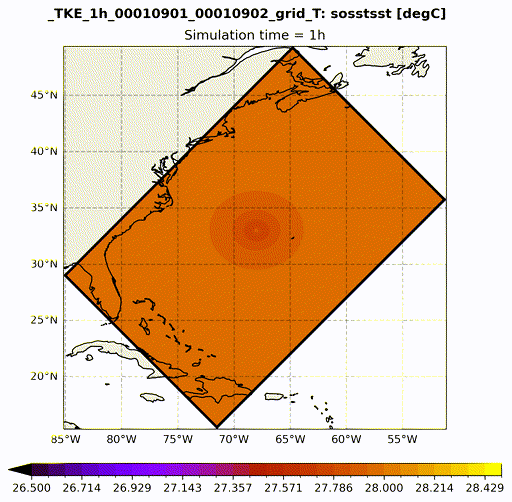
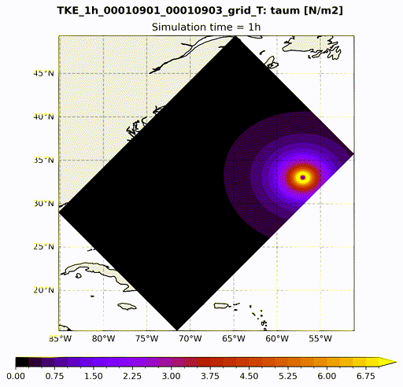
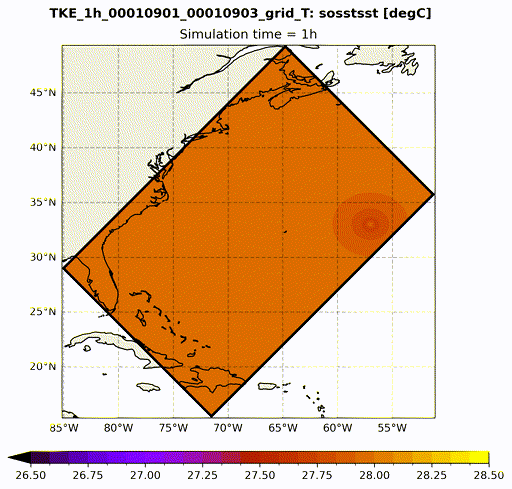
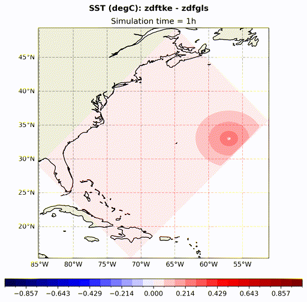
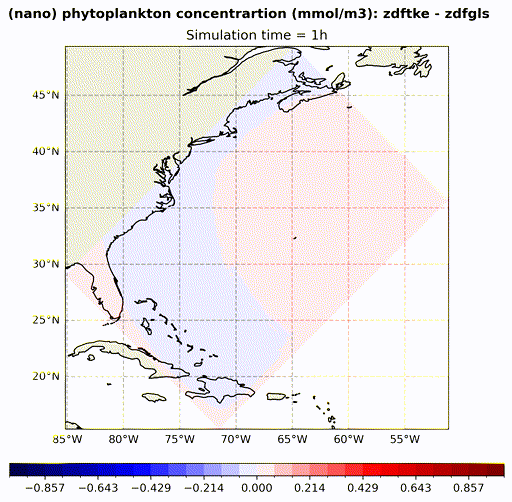

# TCMIX demonstration case

**TCMIX** is a NEMO configuration based on the `GYRE_PISCES` reference setup. It provides a controlled framework for testing turbulent vertical mixing schemes in the NEMO model under tropical cyclone (TC) wind forcing.

# Background

Tropical cyclones significantly influence the upper ocean by driving strong wind-induced mixing and upwelling, which alter the thermal structure near the surface. These changes are critical as they affect the available ocean’s heat content that supports the storm development and intensification. Capturing these complex interactions in numerical models demands accurate representation of vertical mixing processes and the ocean’s dynamic response to extreme wind conditions.

# Objectives

This demonstration aims to evaluate the sensitivity of physical and biogeochemical ocean responses to:
- Idealized TC wind fields.
- Different vertical mixing parameterizations in NEMO.
- Varying grid resolutions.

# Key features and namelist options

- **Holland (1980) symmetric wind field**

The wind forcing is re-constructed using the Holland (1980) parametric cyclone model implemented in this configuration, which is widely used in the literature and relies on the gradient wind balance characteristic of mature tropical cyclones. It calculates the wind speed distribution based on a circular pressure field, which is determined using the central pressure, environmental pressure, and the radius of maximum winds.



where,
- `v_r`: Tangential wind speed (m/s)
- `b`: Shape parameter
- `ρ`: Air density = 1.15 kg/m³
- `e`: Euler’s number ≈ 2.718
- `v_m`: Max sustained wind speed (user-defined)
- `p_oci`: Pressure at outermost closed isobar (Pa)
- `p_c`: Central pressure (Pa)
- `r`: Distance from storm center (km)
- `R_m`: Radius of max winds (km)
- `f`: Coriolis parameter depending on latitude `φ`

Example `namelist_cfg` block under `&namusr_def`.

```!-----------------------------------------------------------------------
&namusr_def    !   TCMIX user defined namelist
!-----------------------------------------------------------------------
   lon0  = -68.0        ! initial cyclone center's Longitude coordinate [Eastern degree]
   lat0  = 33.0         ! initial cyclone center's Latitude coordinate [Northern degree]
   rmw   = 50.0         ! radius of maximum sustained wind speed [km]
   msw   = 50.0         ! maximum sustained wind speed [m/s]
   pc    = 95000.0      ! pressure at the centre of the storm [Pa]
   poci  = 101000.0     ! pressure at outermost closed isobar of the storm [Pa]
   ln_move = .false.    ! =T: Moving TC along the initial Latitude westward | =F stationary TC
   tc_speed    = 0.05   ! cyclone moving speed [m/s]
  /
```

- **User-defined parameters for initial T/S profiles** in `namelist_cfg` under `&namusr_def`

```!-----------------------------------------------------------------------
&namusr_def    !   TCMIX user defined namelist
!-----------------------------------------------------------------------
   t_surf = 28.0       ! Surface temp (degC)
   t_deep = 4.0        ! Deep ocean temp (degC)
   z_mid_t  = 100.0    ! Midpoint thermocline depth (m)
   dz_tcl = 40.0       ! Thermocline thickness scale (m)
   s_surf  = 36.0      ! Surface salinity (PSU)
   s_deep  = 36.5      ! Deep ocean salinity (PSU)
   z_mid_s = 180.0     ! Salinity gradient midpoint (m)
   dz_scl  = 80.0      ! Salinity thickness scale (m)
/
```

Please note that in the current TCMIX setup the initial temperature and salinity profiles assumed to be horizontally uniform.

- **Costumizable model domain** in `namelist_cfg` under `&namusr_def`

```!-----------------------------------------------------------------------
&namusr_def    !   TCMIX user defined namelist
!-----------------------------------------------------------------------
   nn_GYRE     =     4     !  TCMIX resolution [1/degrees] based on GYRE reference config domain
   jpkglo      =    31     !  number of model levels
/
```

# How to run
Before start, if you haven't compiled NEMO model on your machine, you can follow the instructions [here](https://sites.nemo-ocean.io/user-guide/install.html#download-and-install-the-nemo-code).

1) First, go to the root of your NEMO working copy and clone this git repository: [https://github.com/gkara00/TCMIX](https://github.com/gkara00/TCMIX_demo)
```
cd <path-to-nemo>/cfgs
git clone https://github.com/gkara00/TCMIX_demo.git
```

2) Build a new configuration (here called `MY_TCMIX`) from GYRE_PISCES reference configuration with:
```
cd ../
./makenemo -m <my_arch> -r 'GYRE_PISCES' -n MY_TCMIX -j 4
```
where `<my_arch>` is the name that refers to your computing environment.

3) Copy the TCMIX Fortran subroutines in to your `MY_TCMIX` configuration:
```
cp ./cfgs/TCMIX_demo/MY_SRC/*.F90 ./cfgs/MY_TCMIX/MY_SRC/
```

4) Recompile your configuration with:
 ```
 ./makenemo -m <my_arch> -r 'GYRE_PISCES' -n MY_TCMIX clean
 ./makenemo -m <my_arch> -r 'GYRE_PISCES' -n MY_TCMIX -j 4
 ```
 Once `makenemo` has run successfully, a symbolic link to the nemo executable is available in `./cfgs/MY_TCMIX/EXP00`

 5) Prepare the `EXP00` run folder with `namelist_cfg` and `.xml` files of TCMIX configuration:
 ```
 cp ./cfgs/TCMIX_demo/EXPREF/{namelist_cfg, *.xml} ./cfgs/MY_TCMIX/EXP00
 ```

 6) Download a restart file for PISCES biogeochemistry [here](https://drive.google.com/drive/folders/1yqTVkbGqbG2bP5RWfq1YJB3LsUwdc0Tw?usp=sharing)
 and link it to the run directory. It is a restart from a 2-year simulation with GYRE_PISCES configuration at 1/4 horizontal resolution.
 ```
 ln -sf <path-to-donwload>/GYRE4_restart_trc.nc ./cfgs/EXP00/MY_TCMIX/GYRE4_restart_trc.nc
 ```

 7) Run the model as per standard NEMO execution (here on a 40 cores node)
 ```
 cd ./cfgs/MY_TCMIX/EXP00
 mpirun -n 40 ./nemo
 ```

# Sensitivity runs
1) Change the vertical mixing scheme and give a new name to your experiment:

```!-----------------------------------------------------------------------
&namrun        !   parameters of the run
!-----------------------------------------------------------------------
   cn_exp      =  "TKE"   !  experience name
/
!-----------------------------------------------------------------------
&namzdf        !   vertical physics                                     (default: NO selection)
!-----------------------------------------------------------------------
   ln_zdfcst   = .false.      !  constant mixing
   ln_zdfric   = .false.      !  local Richardson dependent formulation (T =>   fill namzdf_ric)
   ln_zdftke   = .true.       !  Turbulent Kinetic Energy closure        (T =>   fill namzdf_tke)
   ln_zdfgls   = .false.      !  Generic Length Scale closure           (T =>   fill namzdf_gls)
   ln_zdfosm   = .false.      !  OSMOSIS BL closure                     (T =>   fill namzdf_osm)
/
```

2) Adjust the horizontal resolution in `namelist_cfg` with `nn_GYRE` and/or the run duration in the `&namrun` block.

# Sample outputs

- **Stationary vs Moving cyclone**

|  |  |
|---------------------------|---------------------------|
|  |  |
|---------------------------|---------------------------|
| Wind Stress Modulus                | Sea Surface Tmperature            |

- **zdftke minus zdfgls vertical mixingdifference vs Moving cyclone**

|---------------------------|---------------------------|
|  |  |
|---------------------------|---------------------------|
| Sea Surface Tmperature             | (nano)Phytoplankton Concentration          |

# Acknowledgments

This demonstrator was developed as part of [NEMO Zoo Hackathon](https://forge.nemo-ocean.eu/nemo/nemo/-/wikis/NEMO-Party-2025-Info) held on June 16-2025 at the UK Met Office (Exeter). Many thanks to Dr. Julien Palmieri and Dr. Renaud Person for the mentoring and insightfull discussions.

# Future enhancements
- TODOs

# References
Holland, Greg J. 1980. “An Analytic Model of the Wind and Pressure Profiles in Hurricanes.” Monthly Weather Review 108 (8): 1212–18. https://doi.org/10.1175/1520-0493(1980)108<1212:AAMOTW>2.0.CO;2.
